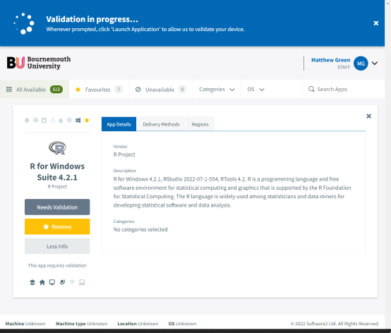
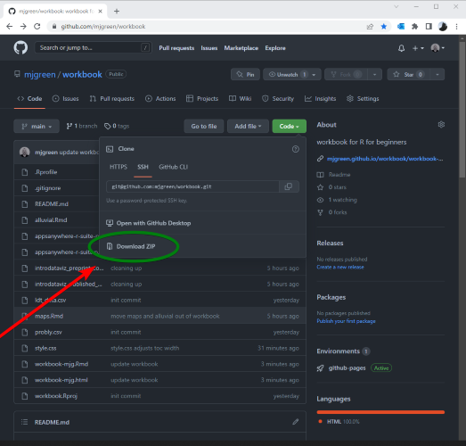
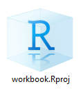

# R for beginners

Information about the _R for beginners_ course in October 2022 at BU.

## Set up R / RStudio

Use AppsAnywhere

* Click this [direct link to the correct version](https://appsanywhere.bournemouth.ac.uk?id=2468&name=R%20for%20Windows%20Suite%204.2.1)
* Or visit [AppsAnywhere's homepage](https://appsanywhere.bournemouth.ac.uk) and use the search box and paste in `R for Windows Suite 4.2.1` - avoid accidentally choosing one of the many alternatives with similar names - then star it to add it to your favourites so you can find it again more easily next time
* Now you can fire up `RStudio` by clicking on the windows start button and typing `RStudio`
* If you're on a Mac, ask Matt to set it up for you in the class, or see the links for [R itself](https://cran.r-project.org/bin/macosx/) and for [Rstudio](https://www.rstudio.com/products/rstudio/download/#download)

## Set up for the course _R for beginners_

The course consists of:

* a github repository at [github.com/mjgreen/workbook](https://github.com/mjgreen/workbook/) 
* an R package `beginr` at  [github.com/mjgreen/beginr](https://github.com/mjgreen/beginr)

Steps

* Go to the github repository
* Download zip

* Unzip
* Double-click on `workbook.Rproj`

## `introdataviz`

We make extensive use of the University of Glasgow's _introdataviz_ approach - a tutorial that teaches how to use R's plotting routines to carry out visual exploratory data analysis - with 3 main components:

* A __journal article__[^1] in pdf format for printing: as well as a __revised version__[^2] that corrects some errors in the published article
* An __interactive website__[^3] that gives the code that generates each plot in the article; the images of the plots themselves; some explanatory material in plain English; and some self-test exercises with their solutions. 
* An Rmarkdown __workbook__[^4] which you use to run the code on your own computer and record your answers to the self-tests from the website, together with the __output from the workbook__[^5]

[^1]: Nordmann, E., McAleer, P., Toivo, W., Paterson, H. & DeBruine, L. (2022). Data visualisation using R, for researchers who don't use R. Advances in Methods and Practices in Psychological Science. https://doi.org/10.1177/25152459221074654
[^2]: Revised version at [https://osf.io/5e64r](https://osf.io/5e64r)
[^3]: Interactive website at [https://psyteachr.github.io/introdataviz/index.html](https://psyteachr.github.io/introdataviz/index.html)
[^4]: Workbook in RMarkdown format in the zip file available from [https://github.com/mjgreen/workbook/archive/refs/heads/main.zip](https://github.com/mjgreen/workbook/archive/refs/heads/main.zip) 
[^5]: Output from the workbook as a website at  [https://mjgreen.github.io/workbook/workbook-mjg.html](https://mjgreen.github.io/workbook/workbook-mjg.html)
